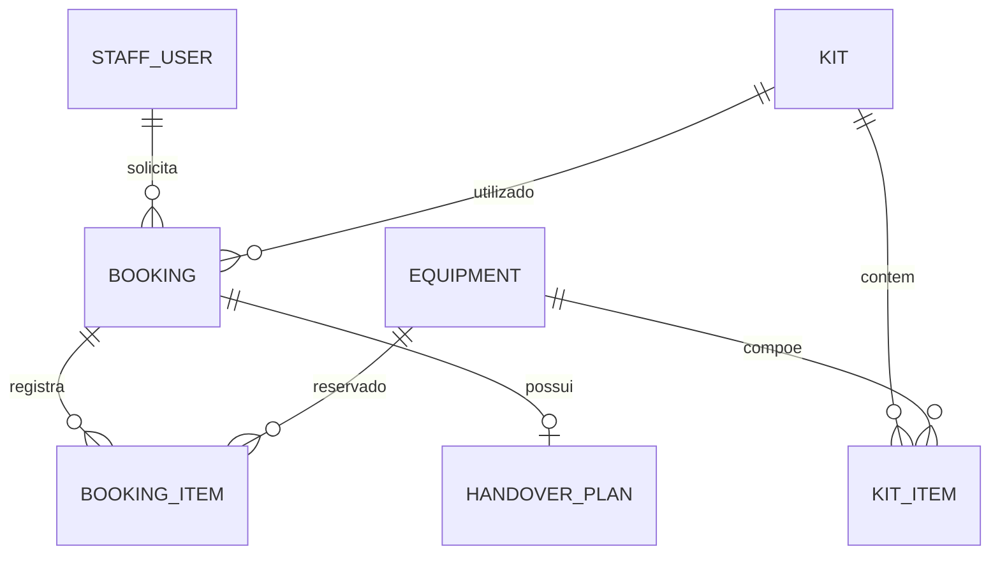

-----

<p align="center">
  
</p>

-----


# Lista 02 — Padrões Criacionais

O ReservaPatterns é uma API para organizar o empréstimo de equipamentos de um
laboratório universitário. A equipe cadastra equipamentos, monta kits para
atividades, reserva esses kits para aulas ou pesquisas e define como serão
retirados e devolvidos.

O projeto inicial já contém a aplicação Spring Boot, persistência, autenticação
com Spring Security, regras de acesso, Docker e testes. Nesta lista, seu grupo
implementará **Builder, Prototype, Factory Method e Abstract Factory** nas
classes indicadas adiante.

## Entregáveis

- Um **fork por grupo** e **um pull request por grupo** para o repositório
  oficial.
- Implementações em Java somente nos diretórios `kit/creation`,
  `booking/creation` e `handover/creation`. É permitido criar classes
  auxiliares dentro deles.
- Testes dos quatro requisitos e do fluxo completo passando; avaliação
  automática registrada no pull request.

Não é necessário implementar a segurança, os controllers, as entidades ou o
Dockerfile. Eles fazem parte da base sobre a qual os padrões serão aplicados.

## Orientações

### 1. Prepare o ambiente

Você precisará de **Java 17 e Maven** para rodar os testes localmente. Para
executar a API com PostgreSQL, use **Docker e Docker Compose**. O `pom.xml`
declara as dependências do Spring Boot; o `Dockerfile` constrói o JAR e o
`compose.yaml` inicia a API junto com o banco.

Crie seu fork, clone-o e trabalhe em uma branch do grupo:

```bash
git clone <url-do-fork>
cd <pasta-do-projeto>
git switch -c lista-02-grupo
```

Faça commits durante o desenvolvimento e envie a branch para o fork. A seção
[Entrega](#entrega) explica como abrir o pull request.

### 2. Execute a API com Docker

O arquivo `.env.example` contém os nomes das cinco variáveis necessárias.
Copie-o para `.env` e preencha `RESERVA_DB_PASSWORD`,
`RESERVA_JWT_SECRET` e `RESERVA_ADMIN_PASSWORD`. O usuário do banco e o
nome do administrador já têm exemplos; você pode alterá-los. A senha do
administrador precisa ter pelo menos oito caracteres; a chave do JWT,
**32 bytes ou mais**. Para gerar uma chave aleatória, execute
`openssl rand -hex 32` e coloque o resultado em `RESERVA_JWT_SECRET`.

```bash
cp .env.example .env
docker compose --env-file .env up --build
```

A API atende em `http://localhost:8080`. O administrador informado em
`.env` é criado se ainda não existir no banco. Alterar a senha em `.env`
depois disso **não altera** a senha já salva. O volume do PostgreSQL
preserva os dados entre inicializações. O arquivo `.env` está no
`.gitignore` e não deve entrar no commit.

### 3. Execute sem Docker, se preferir

Configure as variáveis `RESERVA_ADMIN_USER`,
`RESERVA_ADMIN_PASSWORD` e `RESERVA_JWT_SECRET` no ambiente do terminal
e execute `mvn spring-boot:run`. Nessa configuração, a aplicação usa H2 em
memória; os dados são perdidos ao desligá-la. O comando Maven não lê
automaticamente o arquivo `.env`.

Para rodar apenas os testes, não é necessário iniciar a API. O perfil
`test` configura H2 e dispensa as variáveis de inicialização do administrador.

### 4. Obtenha um token

Faça login com o administrador configurado no ambiente:

```http
POST /api/auth/login
Content-Type: application/json

{
  "username": "admin",
  "password": "<senha configurada>"
}
```

Em caso de sucesso, a resposta contém:

```json
{
  "token": "<JWT retornado pela API>",
  "tokenType": "Bearer"
}
```

Nas outras rotas, envie `Authorization: Bearer <JWT retornado pela API>`.
O token expira após duas horas. A rota de login é a única rota pública.
Para criar contas usadas nos exemplos, o administrador pode fazer:

```http
POST /api/staff/users
Authorization: Bearer <token-do-admin>
Content-Type: application/json

{
  "username": "ana",
  "password": "<senha com pelo menos 8 caracteres>",
  "role": "RESEARCHER"
}
```

A resposta `201 Created` inclui `id`, `username` e `role`; a senha
nunca é devolvida. Crie também uma conta `STAFF` para cadastrar
equipamentos e kits. A API não permite criar outra conta `ADMIN` por
essa rota.

## Especificações do projeto

### Organização do código

Os pacotes separam o domínio e, dentro de cada domínio, as responsabilidades:

| Local | Responsabilidade |
| --- | --- |
| `advice`, `dto`, `exception` | Respostas e tratamento de erros compartilhados. |
| `equipment` | Catálogo e quantidade total de cada equipamento. |
| `kit` | Kits, itens e operações de montagem e cópia. |
| `booking` | Reservas, itens registrados e verificação de disponibilidade. |
| `handover` | Plano de retirada e devolução de uma reserva. |
| `staff` | Contas, papéis, login, JWT e configuração do Spring Security. |

Em cada módulo de domínio há pacotes para `controller`, `dto`,
`entity`, `repository` e `service`. Os pacotes `creation` de `kit`,
`booking` e `handover` contêm os exercícios. Por exemplo, o controller
recebe a requisição, o serviço usa `KitBuilder` e o repositório salva
o `Kit`. Seu grupo implementa a peça de criação utilizada nesse fluxo.

### Modelo de dados e regras já fornecidas



`KitItem` indica os equipamentos necessários para montar um kit.
`BookingItem` registra a **quantidade no instante da reserva**: mudar
um kit depois não altera as reservas que já foram feitas.

O serviço de reservas consulta intervalos sobrepostos e rejeita, com
`409 Conflict`, uma nova reserva que ultrapassaria a quantidade total
de algum equipamento. Reservas pendentes também ocupam essa
quantidade. Para a criação concorrente, o serviço bloqueia os
equipamentos antes de calcular a disponibilidade.

### Segurança e rotas disponíveis

Os papéis são `ADMIN`, `STAFF` e `RESEARCHER`. As senhas são
armazenadas com BCrypt. O login valida usuário e senha e devolve um
JWT assinado. As regras de autorização já vêm implementadas.

| Rota | Quem pode usar |
| --- | --- |
| `POST /api/auth/login` | Público. |
| `POST /api/staff/users` | ADMIN; só pode criar STAFF ou RESEARCHER. |
| `POST /api/equipments` | ADMIN e STAFF. |
| `GET /api/equipments` e `GET /api/equipments/{id}` | Qualquer pessoa autenticada. |
| `POST /api/kits`, `POST /api/kits/{id}/copies`, `PATCH /api/kits/{id}/items/{itemId}` | ADMIN e STAFF. |
| `GET /api/kits` e `GET /api/kits/{id}` | Qualquer pessoa autenticada. |
| `POST /api/bookings` | Qualquer pessoa autenticada. |
| `GET /api/bookings/{id}` | ADMIN e STAFF; RESEARCHER apenas na própria reserva. |
| `PATCH /api/bookings/{id}/approve` | ADMIN e STAFF. |
| `POST /api/handovers` | ADMIN e STAFF. |
| `GET /api/handovers/{id}` | ADMIN e STAFF; RESEARCHER apenas no plano da própria reserva. |

Uma requisição sem autenticação recebe `401 Unauthorized`. Uma pessoa
autenticada sem permissão recebe `403 Forbidden`. Os erros de validação
da aplicação recebem `400 Bad Request`; identificadores inexistentes,
`404 Not Found`; duplicidades e conflitos de disponibilidade,
`409 Conflict`. Erros produzidos pela aplicação usam o formato
`{"error":"mensagem"}`.

## Requisitos

### 1. Builder — montar um kit válido (25 pontos)

Implemente `kit/creation/KitBuilder.java`. O serviço `KitService` já
invoca `description(...)`, `add(...)` e `build()`; preserve essas
assinaturas. O builder deve permitir encadear `description` e
`add`, então construir um `Kit` com seus `KitItem`.

Regras que a implementação deve cumprir:

1. O kit precisa ter nome não vazio e ao menos um item.
2. A descrição pode ser vazia. Na API, uma descrição ausente é tratada
   como vazia.
3. A quantidade de um item deve ser positiva e não pode superar
   `Equipment.totalUnits`.
4. Um mesmo equipamento não pode aparecer duas vezes no kit.
5. Cada chamada a `build()` cria um kit e itens novos, mesmo quando
   se reutiliza o mesmo builder.

O cadastro de equipamento, já implementado, permite preparar os dados:

```http
POST /api/equipments
Authorization: Bearer <token-de-STAFF>
Content-Type: application/json

{
  "name": "Microscópio",
  "totalUnits": 3
}
```

Resposta de exemplo (`201 Created`):

```json
{
  "id": 1,
  "name": "Microscópio",
  "totalUnits": 3
}
```

Com `equipmentId` igual ao `id` retornado, o requisito é observado em
`POST /api/kits`:

```json
{
  "name": "Aula de biologia",
  "description": "Turma 2",
  "items": [
    {"equipmentId": 1, "quantity": 2}
  ]
}
```

Resposta esperada (`201 Created`):

```json
{
  "id": 1,
  "name": "Aula de biologia",
  "description": "Turma 2",
  "items": [
    {
      "id": 1,
      "equipmentId": 1,
      "equipmentName": "Microscópio",
      "quantity": 2
    }
  ]
}
```

Quantidade maior que o estoque ou equipamento repetido deve produzir
`400 Bad Request`. Um `equipmentId` inexistente produz
`404 Not Found`. Rode `mvn -Dtest=Req01BuilderTest test` para
verificar o requisito isoladamente.

### 2. Prototype — duplicar um kit (20 pontos)

Implemente `kit/creation/KitPrototype.java`. Seu construtor recebe o
kit original; `copy()` devolve outro `Kit` com o mesmo nome,
descrição e quantidades.

A cópia deve conter **novos objetos `KitItem`** e manter a referência
aos mesmos objetos `Equipment` do catálogo. Alterar o nome ou a
quantidade de um item da cópia não pode alterar o original. A cópia
ainda não tem `id` antes de ser salva; o serviço a renomeia e persiste.

Com o kit criado no requisito 1, use:

```http
POST /api/kits/1/copies
Authorization: Bearer <token-de-STAFF>
Content-Type: application/json

{"name": "Aula de biologia B"}
```

Resposta de exemplo (`201 Created`):

```json
{
  "id": 2,
  "name": "Aula de biologia B",
  "description": "Turma 2",
  "items": [
    {
      "id": 2,
      "equipmentId": 1,
      "equipmentName": "Microscópio",
      "quantity": 2
    }
  ]
}
```

O `id` do equipamento continua o mesmo; os `id` do kit e do item
são novos. Use `PATCH /api/kits/2/items/2` com
`{"quantity":1}` e depois `GET /api/kits/1`: o kit original deve
continuar com quantidade 2. Um kit de origem inexistente retorna
`404 Not Found`. Rode `mvn -Dtest=Req02PrototypeTest test`.

### 3. Factory Method — abrir reservas de tipos diferentes (25 pontos)

Implemente as três classes de `booking/creation`:

| Classe | Responsabilidade |
| --- | --- |
| `BookingCreator` | Método `open(...)`: verifica os argumentos, chama o método de fábrica `create(...)` e adiciona à reserva um `BookingItem` para cada item do kit. |
| `LectureBookingCreator` | `create(...)` produz `LECTURE`, com duração de 4 horas e status inicial `CONFIRMED`. |
| `ResearchBookingCreator` | `create(...)` produz `RESEARCH`, com duração de 48 horas e status inicial `PENDING`. |

O `Kit` precisa conter itens. `BookingItem` guarda a quantidade da
reserva independentemente de mudanças posteriores no `KitItem`. As
classes concretas já são registradas no Spring com os nomes
`LECTURE` e `RESEARCH`; preserve esse vínculo para que
`BookingService` escolha a implementação correta.

Uma pessoa autenticada pode solicitar uma pesquisa usando o kit 1:

```http
POST /api/bookings
Authorization: Bearer <token-de-RESEARCHER>
Content-Type: application/json

{
  "kitId": 1,
  "startsAt": "2030-04-02T09:00:00",
  "kind": "RESEARCH"
}
```

Resposta esperada (`201 Created`, com `ana` autenticada):

```json
{
  "id": 1,
  "kitId": 1,
  "requester": "ana",
  "startsAt": "2030-04-02T09:00:00",
  "endsAt": "2030-04-04T09:00:00",
  "kind": "RESEARCH",
  "status": "PENDING",
  "items": [
    {
      "equipmentId": 1,
      "equipmentName": "Microscópio",
      "quantity": 2
    }
  ]
}
```

Com `"kind":"LECTURE"`, o término seria
`2030-04-02T13:00:00` e o status `CONFIRMED`. O STAFF ou o
ADMIN pode confirmar uma pesquisa pendente com
`PATCH /api/bookings/1/approve`; tentar confirmar de novo resulta
em `409 Conflict`. Reservas sobrepostas que excedam o estoque
também retornam `409 Conflict`. Rode
`mvn -Dtest=Req03FactoryMethodTest test`.

### 4. Abstract Factory — combinar retirada e devolução (25 pontos)

Implemente `CounterHandoverFactory` e
`CourierHandoverFactory` em `handover/creation`. A interface
`HandoverFactory` já define dois métodos: `pickup(...)` cria
`PickupTerms` e `returns(...)` cria `ReturnTerms`. Cada
fábrica precisa produzir os **dois produtos do mesmo modo**:

| Modo | Retirada | Devolução |
| --- | --- | --- |
| `COUNTER` | `method=COUNTER`, `location=Laboratório central`, `feeCents=0`. | `method=COUNTER`, mesmo local, `dueAt` igual a `Booking.endsAt`. |
| `COURIER` | `method=COURIER`, destino informado, `feeCents=1500`. | `method=COURIER`, mesmo destino, `dueAt` igual a `Booking.endsAt`. |

Preencha também `instructions` não vazias nos dois produtos.
Para `COURIER`, o destino é obrigatório e deve ter até 200
caracteres; espaços nas pontas não fazem parte do local salvo.
`COUNTER` dispensa `destination`.

O plano só pode ser criado para uma reserva `CONFIRMED` e é único
por reserva. Depois de aprovar a reserva do exemplo anterior, uma
pessoa com papel STAFF ou ADMIN pode enviar:

```http
POST /api/handovers
Authorization: Bearer <token-de-STAFF>
Content-Type: application/json

{
  "bookingId": 1,
  "mode": "COURIER",
  "destination": "Bloco B, sala 204"
}
```

Resposta de exemplo (`201 Created`):

```json
{
  "id": 1,
  "bookingId": 1,
  "mode": "COURIER",
  "pickup": {
    "method": "COURIER",
    "location": "Bloco B, sala 204",
    "feeCents": 1500,
    "instructions": "Entrega mediante identificação do solicitante"
  },
  "returns": {
    "method": "COURIER",
    "location": "Bloco B, sala 204",
    "dueAt": "2030-04-04T09:00:00",
    "instructions": "Prepare todos os itens para recolhimento"
  }
}
```

No modo `COUNTER`, a resposta deve usar `Laboratório central`,
`feeCents=0` e métodos `COUNTER`. Sem destino no modo
`COURIER`, a API retorna `400 Bad Request`. Uma reserva
pendente ou um segundo plano para a mesma reserva retornam
`409 Conflict`. Rode `mvn -Dtest=Req04AbstractFactoryTest test`.

## Testes e avaliação

Execute os comandos na raiz do projeto:

```bash
mvn -Dtest=SecurityBaselineTest test
mvn -Dtest=Req01BuilderTest test
mvn -Dtest=Req02PrototypeTest test
mvn -Dtest=Req03FactoryMethodTest test
mvn -Dtest=Req04AbstractFactoryTest test
mvn -Dtest=ReservationFlowTest test
mvn test
mvn checkstyle:check
```

`SecurityBaselineTest` verifica login, senha, papéis e acesso às
reservas. Deve passar **antes** de resolver os exercícios.
`Req01`–`Req04` verificam cada padrão sem depender dos outros.
`ReservationFlowTest` exercita equipamentos, kit, cópia, reserva,
aprovação e entrega pela API; só deve passar após os quatro
requisitos. Por isso, `mvn test` **falha no projeto inicial** e
passa quando o trabalho está concluído.

| Critério | Pontos |
| --- | ---: |
| Builder | 25 |
| Prototype | 20 |
| Factory Method | 25 |
| Abstract Factory | 25 |
| Estilo das classes dos exercícios (Checkstyle) | 5 |
| **Total** | **100** |

A nota mínima é **80 pontos**. A segurança base precisa passar para
que haja nota, e o fluxo HTTP completo também precisa passar para
que o resultado seja aprovado. O workflow copia **somente os
arquivos Java dos três diretórios `creation`** do fork sobre a base
oficial. Alterações no `pom.xml`, nos testes, no workflow, nos
controllers ou na segurança do fork não entram nessa avaliação.
O comentário no pull request informa a pontuação por requisito.

## Entrega

1. Desenvolva no fork do grupo e confirme que `.env`, `target/` e
   outras saídas locais não foram incluídas no commit.
2. Execute os testes locais e o Checkstyle.
3. Envie sua branch: `git push -u origin lista-02-grupo`.
4. No GitHub, abra **um pull request da branch do fork para a
   branch principal do repositório oficial**. Indique os membros do
   grupo e um resumo das decisões dos quatro padrões.
5. Leia o resultado do avaliador no pull request. Novos pushes na
   mesma branch atualizam a avaliação.
